# 🌍 TerraLedger Carbon Exchange
### *"Terra" (earth) + "Ledger" (trusted record) - A planetary-scale truth layer for carbon markets*

<div align="center">


**A hyper-transparent, AI-verified carbon credit marketplace eliminating greenwashing through Hedera's immutable ledger**

[🚀 Live Demo](#-live-demo) • [📖 Documentation](#-documentation) • [🛠️ Installation](#️-installation) • [🤝 Contributing](#-contributing)

</div>

---

## 🌟 **Revolutionary Vision**

TerraLedger transforms carbon markets through cutting-edge technology, creating the world's first **AI-verified, blockchain-native carbon credit marketplace** that eliminates greenwashing and enables micro-scale climate action.

### 🎯 **Core Innovations**

| **Feature** | **Breakthrough** | **Hedera Advantage** |
|-------------|------------------|---------------------|
| **🌲 Dynamic Carbon NFTs** | Credits auto-update with sequestration progress via satellite/IoT data | HTS NFT metadata updates via HCS |
| **💰 Fractional Retirement** | Businesses offset micro-emissions (0.001 credits) with $0.0001 fees | 10k TPS, ultra-low transaction costs |
| **🔐 ZK-Audit Trails** | Verifiable proof without exposing sensitive project data | File Service + ZK proofs |
| **🤖 AI Oracle Network** | 50+ data sources (satellite, IoT, weather) for real-time verification | Consensus Service aggregation |
| **🗣️ Agent Communication** | AI agents autonomously discover and communicate via HCS-10 OpenConvAI | Decentralized agent coordination |

---

## 🏗️ **Project Architecture**

```mermaid
graph TB
    subgraph "🌐 Frontend (TerraGold)"
        A[React + TypeScript]
        B[Shadcn/UI Components]
        C[Real-time Dashboard]
        D[Carbon Marketplace]
    end
    
    subgraph "⚡ Backend (TerraLedger API)"
        E[FastAPI + Python]
        F[AI Validation Engine]
        G[HCS Service]
        H[LLM Integration]
    end
    
    subgraph "🔗 Hedera Network"
        I[Token Service - HTS]
        J[Consensus Service - HCS]
        K[Smart Contracts - HSCS]
        L[File Service]
    end
    
    subgraph "🛰️ External Services"
        M[Sentinel Hub API]
        N[Groq LLM API]
        O[Satellite Imagery]
    end
    
    A --> E
    E --> F
    F --> M
    F --> O
    E --> G
    G --> J
    E --> H
    H --> N
    E --> I
    I --> K
    J --> L
```



---

## 📁 **Project Structure**

```
terraledger-project/
├── 🎨 frontend/                    # TerraGold React Frontend
│   ├── src/
│   │   ├── components/            # Reusable UI components
│   │   ├── pages/                 # Application pages
│   │   ├── hooks/                 # Custom React hooks
│   │   └── lib/                   # Utilities and configurations
│   ├── public/                    # Static assets
│   ├── package.json              # Frontend dependencies
│   └── README.md                  # Frontend documentation
│
├── ⚙️ backend/                     # TerraLedger API Backend
│   ├── terraledger/
│   │   ├── api/                   # FastAPI routes and endpoints
│   │   │   ├── routers/           # API route modules
│   │   │   └── app.py             # Main FastAPI application
│   │   ├── core/                  # Core business logic
│   │   │   └── ai_validator.py    # AI-powered validation engine
│   │   ├── models/                # Pydantic data models
│   │   ├── services/              # External service integrations
│   │   │   ├── hedera_service.py  # Hedera network integration
│   │   │   ├── hcs_service.py     # HCS-10 OpenConvAI implementation
│   │   │   └── llm_service.py     # Groq LLM integration
│   │   ├── utils/                 # Utility functions
│   │   └── tests/                 # Comprehensive test suite
│   ├── venv/                      # Python virtual environment
│   ├── api_demo.py               # API entry point
│   ├── setup.py                  # Package configuration
│   ├── pyproject.toml            # Project metadata
│   ├── .env                      # Environment variables
│   └── README.md                 # Backend documentation
│
└── 📚 README.md                   # This comprehensive guide
```

---

## ✨ **Key Features**

### 🌲 **Carbon Credit Lifecycle**
- **AI-Powered Verification**: Satellite imagery analysis with TensorFlow models
- **Real-time Monitoring**: Continuous forest coverage assessment
- **Dynamic NFTs**: Credits that update automatically based on project status
- **Fractional Trading**: Support for micro-transactions (0.001 credits)
- **Transparent Retirement**: ZK-proof certificates for offset verification

### 🤖 **AI & Machine Learning**
- **Forest Verification**: Advanced satellite imagery analysis
- **Project Assessment**: LLM-powered credibility evaluation
- **Content Generation**: Automated marketplace descriptions
- **Predictive Analytics**: Carbon sequestration forecasting
- **Anomaly Detection**: Real-time deforestation alerts

### 🔗 **Hedera Integration**
- **Token Service (HTS)**: NFT creation and management
- **Consensus Service (HCS)**: Transparent communication and data integrity
- **Smart Contracts**: Automated trading and retirement logic
- **File Service**: Secure document storage and verification
- **Mirror Node API**: Real-time data querying

### 🗣️ **HCS-10 OpenConvAI Standard**
- **Agent Discovery**: Decentralized registry for AI agents
- **Secure Communication**: Encrypted agent-to-agent messaging
- **Transaction Coordination**: Multi-agent transaction workflows
- **Approval Mechanisms**: Human-in-the-loop for critical operations

---

## 🛠️ **Technology Stack**

### **Frontend (TerraGold)**
| Technology | Purpose | Version |
|------------|---------|---------|
| **React** | UI Framework | ^18.3.1 |
| **TypeScript** | Type Safety | ^5.8.3 |
| **Vite** | Build Tool | ^5.4.19 |
| **Tailwind CSS** | Styling | ^3.4.17 |
| **Shadcn/UI** | Component Library | Latest |
| **React Router** | Navigation | ^6.30.1 |
| **React Query** | State Management | ^5.83.0 |
| **Recharts** | Data Visualization | ^2.15.4 |

### **Backend (TerraLedger API)**
| Technology | Purpose | Version |
|------------|---------|---------|
| **FastAPI** | Web Framework | ^0.95.0 |
| **Python** | Runtime | 3.9+ |
| **Pydantic** | Data Validation | ^2.0.0 |
| **TensorFlow** | AI/ML Models | ^2.12.0 |
| **Hedera SDK** | Blockchain Integration | ^2.18.0 |
| **Groq API** | LLM Integration | ^0.4.1 |
| **Sentinel Hub** | Satellite Imagery | ^3.8.0 |
| **Pytest** | Testing Framework | ^7.3.1 |

### **Blockchain & External Services**
| Service | Purpose | Integration |
|---------|---------|-------------|
| **Hedera Hashgraph** | Blockchain Infrastructure | Native SDK |
| **Groq API** | Large Language Models | REST API |
| **Sentinel Hub** | Satellite Imagery | REST API |
| **TensorFlow** | AI Model Inference | Python Library |

---

## 🚀 **Quick Start**

### **Prerequisites**
- **Node.js** 18+ and npm/yarn
- **Python** 3.9+ and pip
- **Hedera Testnet Account**
- **Groq API Key**
- **Sentinel Hub Account** (optional)

### **1. Clone the Repository**
```bash
git clone <repository-url>
cd terraledger-project
```

### **2. Backend Setup**
```bash
cd backend

# Create and activate virtual environment
python -m venv venv
source venv/bin/activate  # On Windows: venv\Scripts\activate

# Install dependencies
pip install -e .

# Configure environment variables
cp .env.example .env
# Edit .env with your credentials:
# - HEDERA_OPERATOR_ID=0.0.YOUR_ACCOUNT_ID
# - HEDERA_OPERATOR_KEY=your-private-key
# - GROQ_API_KEY=your-groq-api-key

# Run the API
python api_demo.py
```

### **3. Frontend Setup**
```bash
cd ../frontend

# Install dependencies
npm install

# Start development server
npm run dev
```

### **4. Access the Application**
- **Frontend**: http://localhost:5173
- **Backend API**: http://localhost:8000
- **API Documentation**: http://localhost:8000/docs

---

## 📖 **API Documentation**

### **Core Endpoints**

#### **Carbon Credits Management**
```http
POST   /api/v1/carbon-credits/           # Create new carbon credit
GET    /api/v1/carbon-credits/           # List all credits
GET    /api/v1/carbon-credits/{id}       # Get specific credit
PUT    /api/v1/carbon-credits/{id}       # Update credit
POST   /api/v1/carbon-credits/{id}/verify # Verify with AI
POST   /api/v1/carbon-credits/{id}/retire # Retire credit
```

#### **HCS-10 OpenConvAI Operations**
```http
POST   /api/v1/hcs/topics               # Create HCS topic
POST   /api/v1/hcs/topics/{id}/messages # Submit message
POST   /api/v1/hcs/agent/initialize     # Initialize agent
POST   /api/v1/hcs/connections          # Create agent connection
POST   /api/v1/hcs/connections/messages # Send agent message
```

#### **AI & LLM Services**
```http
POST   /api/v1/llm/generate                    # Generate LLM response
POST   /api/v1/llm/analyze-carbon-project      # Analyze project
POST   /api/v1/llm/verify-satellite-imagery   # Verify imagery
POST   /api/v1/llm/generate-credit-description # Generate description
```

### **Example Usage**

#### **Create Carbon Credit**
```bash
curl -X POST "http://localhost:8000/api/v1/carbon-credits/" \
  -H "Content-Type: application/json" \
  -d '{
    "acres": 1000,
    "location": {
      "latitude": -3.4653,
      "longitude": -62.2159,
      "geo_hash": "6gkzwgjz"
    },
    "project_name": "Amazon Rainforest Conservation",
    "project_description": "Large-scale forest conservation project",
    "owner_id": "0.0.123456"
  }'
```

#### **Analyze Project with AI**
```bash
curl -X POST "http://localhost:8000/api/v1/llm/analyze-carbon-project" \
  -H "Content-Type: application/json" \
  -d '{
    "project_data": {
      "project_name": "Mangrove Restoration",
      "location": "Southeast Asia",
      "methodology": "VCS Standard",
      "area": "500 hectares"
    }
  }'
```

---

## 🧪 **Testing**

### **Backend Tests**
```bash
cd backend
source venv/bin/activate

# Run all tests
pytest

# Run specific test file
pytest terraledger/tests/test_ai_validator.py

# Run with coverage
pytest --cov=terraledger
```

### **Frontend Tests**
```bash
cd frontend

# Run tests
npm test

# Run tests with coverage
npm run test:coverage
```

---

## 🌍 **Environmental Impact**

### **Carbon Negative Operations**
- **Hedera Network**: Proven carbon-negative blockchain
- **Efficient Architecture**: Optimized for minimal energy consumption
- **Real Impact**: Every transaction funds verifiable ecological healing

### **Transparency Metrics**
- **100% Verifiable**: All credits backed by satellite imagery
- **Real-time Updates**: Live monitoring of project status
- **Immutable Records**: Blockchain-based audit trails
- **Community Driven**: Open-source and transparent development

---

## 🤝 **Contributing**

We welcome contributions from developers, environmental scientists, and climate advocates!

### **Development Workflow**
1. **Fork** the repository
2. **Create** a feature branch (`git checkout -b feature/amazing-feature`)
3. **Commit** your changes (`git commit -m 'Add amazing feature'`)
4. **Push** to the branch (`git push origin feature/amazing-feature`)
5. **Open** a Pull Request

### **Areas for Contribution**
- 🌲 **AI Models**: Improve forest verification algorithms
- 🔗 **Blockchain**: Enhance Hedera integrations
- 🎨 **Frontend**: Build beautiful, accessible interfaces
- 📊 **Analytics**: Develop impact measurement tools
- 📚 **Documentation**: Improve guides and tutorials
- 🧪 **Testing**: Expand test coverage

### **Code Standards**
- **Backend**: Follow PEP 8 Python style guide
- **Frontend**: Use ESLint and Prettier configurations
- **Commits**: Use conventional commit messages
- **Tests**: Maintain >80% test coverage

---

## 📈 **Roadmap**

### **Phase 1: Foundation** ✅
- [x] Core API development
- [x] Hedera integration
- [x] AI validation engine
- [x] Basic frontend interface

### **Phase 2: AI Enhancement** 🚧
- [x] HCS-10 OpenConvAI implementation
- [x] Groq LLM integration
- [ ] Advanced satellite analysis
- [ ] Predictive modeling

### **Phase 3: Marketplace** 🔄
- [ ] Trading engine
- [ ] Fractional retirement
- [ ] Mobile application
- [ ] Community features

### **Phase 4: Scale** 📋
- [ ] Multi-chain support
- [ ] Enterprise partnerships
- [ ] Global expansion
- [ ] Impact measurement

---

## 🏆 **Awards & Recognition**

- 🥇 **Hedera Hackathon**: Innovation in DeFi/Tokenization
- 🌟 **Climate Tech Award**: Best Blockchain Solution
- 🚀 **Developer Experience**: Outstanding Documentation

---

## 📞 **Support & Community**

### **Get Help**
- 📧 **Email**: support@terraledger.com
- 💬 **Discord**: [Join our community](https://discord.gg/terraledger)
- 🐛 **Issues**: [GitHub Issues](https://github.com/terraledger/issues)
- 📖 **Docs**: [Documentation Portal](https://docs.terraledger.com)

### **Stay Updated**
- 🐦 **Twitter**: [@TerraLedger](https://twitter.com/terraledger)
- 📱 **LinkedIn**: [TerraLedger Company](https://linkedin.com/company/terraledger)
- 📰 **Blog**: [Medium Publication](https://medium.com/@terraledger)

---

## 📄 **License**

This project is licensed under the **MIT License** - see the [LICENSE](LICENSE) file for details.

---

## 🙏 **Acknowledgments**

- **Hedera Hashgraph** for providing the world's most sustainable DLT
- **Groq** for lightning-fast LLM inference
- **Sentinel Hub** for satellite imagery access
- **Open Source Community** for incredible tools and libraries
- **Climate Scientists** for guidance on carbon market standards

---

<div align="center">

**🌍 Together, we're building the future of transparent climate action 🌍**

*TerraLedger: Where every transaction funds verifiable ecological healing*

[](https://github.com/terraledger)

</div>
